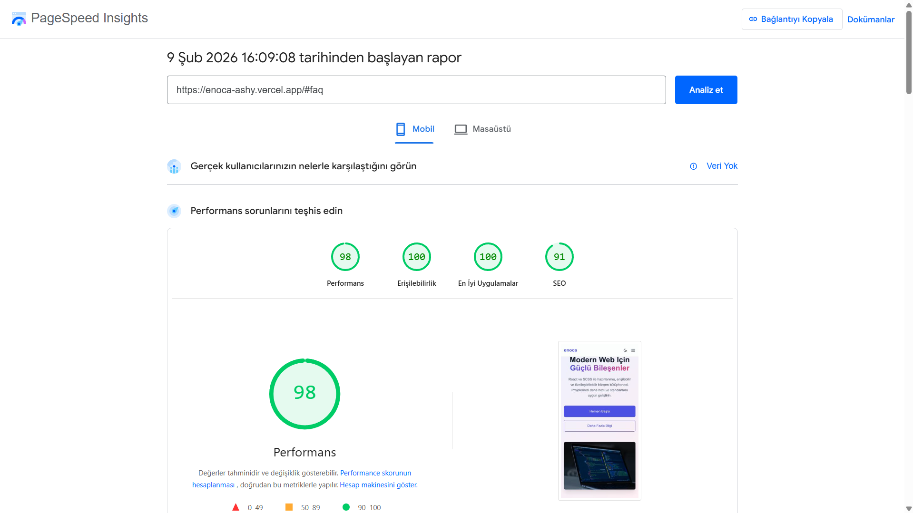

# Mini Landing + Bileşen Kütüphanesi

Bu proje, React, TypeScript ve SCSS kullanılarak geliştirilmiş modern, performanslı ve erişilebilir bir "Mini Landing Page" ve "Bileşen Kütüphanesi" örneğidir.

## 🚀 Özellikler

-   **Modern Teknoloji Yığını:** React 18, TypeScript, Vite.
-   **Özel Bileşen Kütüphanesi:** Button, Input, Card, Modal, Accordion (Harici UI kütüphanesi kullanılmadan, sıfırdan geliştirildi).
-   **SCSS Mimarisi:** CSS Değişkenleri, Mixin'ler ve BEM metodolojisi ile ölçeklenebilir stil yapısı.
-   **Tema Desteği:** Entegre Light / Dark mode desteği ve kolay geçiş anahtarı.
-   **Erişilebilirlik (a11y):** WAI-ARIA standartlarına uygun, klavye ve ekran okuyucu dostu bileşenler.
-   **Performans Odaklı:** Lazy loading, WebP görsel optimizasyonu ve kod bölme (code splitting).
-   **Duyarlı Tasarım (Responsive):** Mobil öncelikli (mobile-first) yaklaşım ile tüm cihazlarda kusursuz görünüm.

## 🛠️ Kurulum ve Çalıştırma

Projeyi yerel ortamınızda çalıştırmak için aşağıdaki adımları izleyin:

1.  **Repoyu klonlayın:**
    ```bash
    git clone https://github.com/kullaniciadi/mini-landing-lib.git
    cd mini-landing-lib
    ```

2.  **Bağımlılıkları yükleyin:**
    ```bash
    npm install
    ```

3.  **Geliştirme sunucusunu başlatın:**
    ```bash
    npm run dev
    ```

4.  **Projeyi derleyin (Build):**
    ```bash
    npm run build
    ```

## 📂 Proje Yapısı

```
src/
├── components/
│   ├── layout/          # Header vb. düzen bileşenleri
│   ├── sections/        # Landing page bölümleri (Hero, Features, Pricing...)
│   └── ui/              # Temel UI bileşenleri (Button, Input, Card...)
├── styles/
│   ├── _mixins.scss     # Responsive breakpoint ve yardımcı mixin'ler
│    ├── _reset.scss      # CSS sıfırlama ve odak (focus) yönetimi
    ├── _variables.scss  # Renk, font, boşluk değişkenleri ve Dark Mode tanımları
    └── main.scss        # Global stil dosyası
├── App.tsx              # Ana uygulama ve bileşen demoları
└── main.tsx             # Giriş noktası
```

## 🏗️ Mimari Notlar

Proje, **Feature-Based** ve **Atomic Design** prensiplerinin hibrit bir yapısını benimser.

- **`components/ui`:** Uygulamanın en küçük yapı taşları (Button, Input, Card). Bu bileşenler "stateless" (durumsuz) veya kendi lokal state'ini yöneten, iş mantığından arındırılmış saf UI elemanlarıdır.
- **`components/sections`:** Landing page'in ana bölümleri (Hero, Pricing, Contact). Bu bölümler UI bileşenlerini bir araya getirir ve sayfa içi yerleşimi belirler.
- **`components/layout`:** Header, Footer gibi tüm sayfalarda ortak olan yapı taşları.
- **Stil Yönetimi (SCSS):** `*.module.scss` dosyaları ile stil izolasyonu sağlanmıştır. Global değişkenler ve mixin'ler `src/styles` altında toplanmıştır.

## 🎨 Renk Paleti

Proje, `src/styles/_variables.scss` dosyasında tanımlanan CSS değişkenlerini kullanır. Ana renkler:

-   **Primary:** İndigo (#6366f1)
-   **Secondary:** Pembe (#ec4899)
-   **Background:** Nötr açık/koyu tonlar

## 📊 Lighthouse Performans Raporu

**Skorlar:**
- 🟢 **Performans:** 98/100
- 🟢 **Erişilebilirlik:** 100/100
- 🟢 **En İyi Uygulamalar:** 100/100
- 🟢 **SEO:** 91/100

*(SEO puanı için meta description eklendi, sonraki testte yükselecektir.)*



*(Not: Bu görseli eklemek için projeyi build edip analiz ettikten sonra ekran görüntüsünü `public/lighthouse-report.png` olarak kaydedin.)*

## 📝 Karar Kayıtları (ADR)

Proje sürecinde alınan teknik ve mimari kararlar `docs/` klasörü altında tutulmaktadır.

- [ADR 001: Teknoloji Seçimi ve Mimari Kararlar](docs/adr-001-teknoloji-secimi.md)

## 🧩 Bileşenler

-   **Button:** Farklı varyantlar (primary, secondary, outline, ghost), boyutlar ve yüklenme durumu.
-   **Input:** Label, hata mesajı, yardımcı metin ve erişilebilirlik özellikleri.
-   **Card:** İçerik kutuları için esnek yapı (default, elevated, outlined).
-   **Modal:** Focus trap, portal ve animasyonlu açılır pencere.
-   **Accordion:** SSS vb. alanlar için açılır/kapanır paneller.

## 📄 Lisans

Bu proje MIT lisansı ile lisanslanmıştır.
