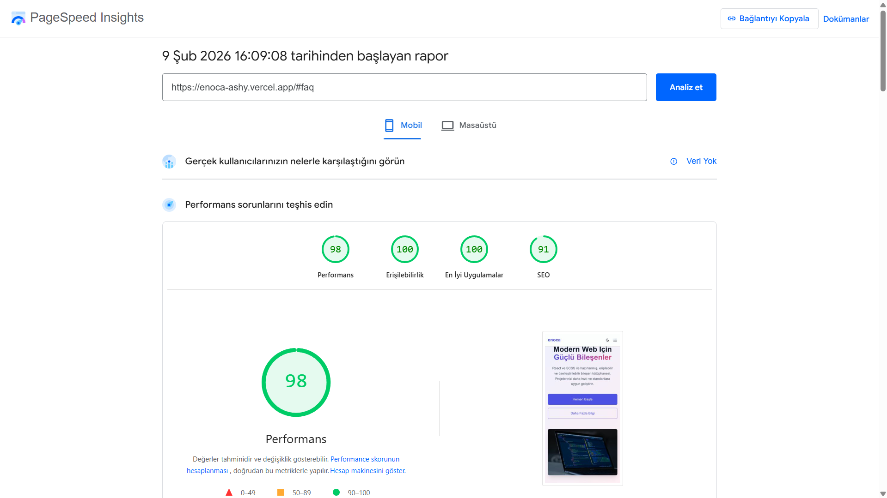
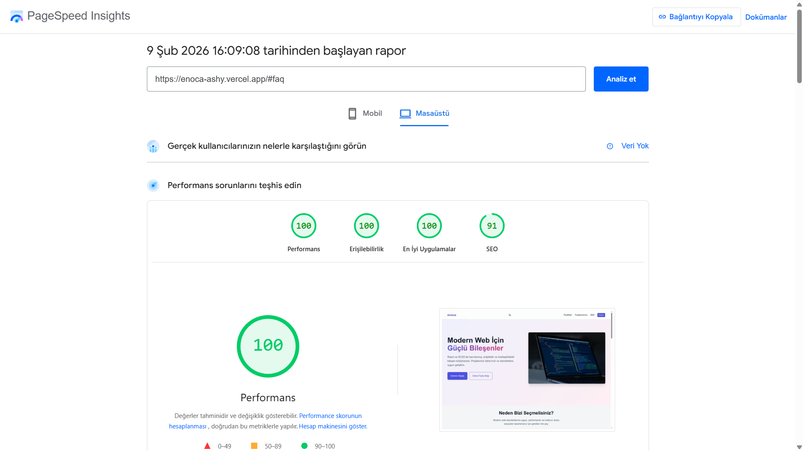

# Mini Landing + Component Library

This project is a modern, performant, and accessible mini landing page and component library built with React, TypeScript, Vite, and SCSS.

## Features

- **Modern stack:** React 19, TypeScript, and Vite
- **Custom component library:** Button, Input, Card, Modal, and Accordion components built from scratch without an external UI library
- **SCSS architecture:** Scalable styling with CSS variables, mixins, and BEM-inspired naming
- **Theme support:** Integrated light/dark mode toggle
- **Accessibility:** Keyboard-friendly and screen-reader-aware components following WAI-ARIA practices
- **Performance focus:** Lazy loading, WebP image optimization, and code splitting
- **Responsive design:** Mobile-first layouts that adapt across screen sizes

## Installation

1. Clone the repository:

```bash
git clone https://github.com/Omer26-26/enoca.git
cd enoca
```

2. Install dependencies:

```bash
npm ci
```

3. Start the development server:

```bash
npm run dev
```

4. Build for production:

```bash
npm run build
```

## Project Structure

```text
src/
├── components/
│   ├── layout/          # Layout components such as Header
│   ├── sections/        # Landing page sections such as Hero, Features, Pricing
│   └── ui/              # Base UI components such as Button, Input, Card
├── styles/
│   ├── _mixins.scss     # Responsive breakpoints and helper mixins
│   ├── _reset.scss      # CSS reset and focus handling
│   ├── _variables.scss  # Colors, fonts, spacing, and dark mode variables
│   └── main.scss        # Global styles
├── App.tsx              # Main app and component demos
└── main.tsx             # Application entry point
```

## Architecture Notes

The project follows a hybrid of feature-based organization and Atomic Design principles.

- **`components/ui`:** Small reusable UI primitives such as Button, Input, and Card. These components are either stateless or manage only local UI state.
- **`components/sections`:** Landing page sections such as Hero, Pricing, and Contact. These sections compose UI primitives into page-level layouts.
- **`components/layout`:** Shared layout pieces such as Header and Footer.
- **SCSS modules:** Component-level style isolation with shared variables and mixins under `src/styles`.

## Color Palette

The project uses CSS variables defined in `src/styles/_variables.scss`.

- **Primary:** Indigo (`#6366f1`)
- **Secondary:** Pink (`#ec4899`)
- **Background:** Neutral light and dark tones

## Lighthouse Report

### Mobile

- **Performance:** 96/100
- **Accessibility:** 100/100
- **Best Practices:** 100/100
- **SEO:** 100/100



### Desktop

- **Performance:** 100/100
- **Accessibility:** 100/100
- **Best Practices:** 100/100
- **SEO:** 100/100



## Architecture Decision Records

Technical and architectural decisions are documented under `docs/`.

- [ADR 001: Technology Choice and Architecture Decisions](docs/adr-001-teknoloji-secimi.md)

## Components

- **Button:** Variants, sizes, and loading state
- **Input:** Label, error message, helper text, and accessibility support
- **Card:** Flexible content container with multiple visual variants
- **Modal:** Portal-based modal with focus management and animation
- **Accordion:** Expandable/collapsible panels for FAQ-style content

## License

This project is licensed under the [MIT License](LICENSE).

